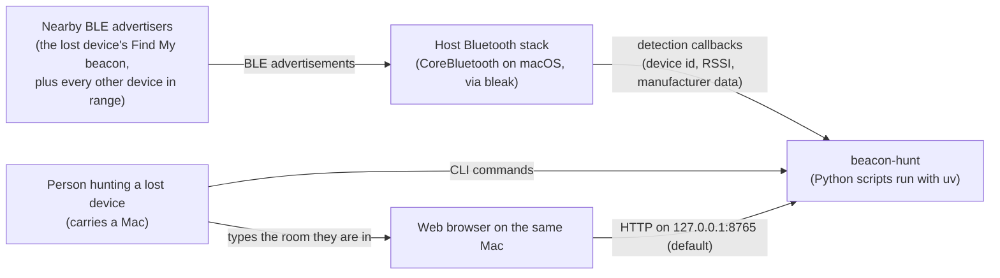

# C4 model: beacon-hunt

Purpose: architecture source of truth for this repo. Read it before changing the
architecture, and update it (plus the change log at the bottom) for every change to
containers, components, dependencies or data flows.

Status: current. Last updated 27 Sep 2026. Written from the code on `main` at commit
`6bd437d`; every name, default and constant below is taken from the source file it
cites.

## Context

One person is looking for a lost Apple device inside a building. They carry a Mac
running these tools from room to room.

- No connections. The tools register a `BleakScanner` detection callback and never
  connect to, pair with, or write to any device. "Passive" in this repo means that,
  not the BLE passive scanning mode: `BleakScanner` is created with bleak's default
  `scanning_mode` (`"active"`), and the scan itself is run by the OS.
- No network service is called. The only listener is the dashboard's HTTP server,
  bound to `127.0.0.1` unless `--host` is passed (`ble_web.py`, `main`).
- Structural limits, stated in the README and the module docstrings: no MAC
  addresses (macOS exposes a per-host CoreBluetooth UUID), no attribution (Find My
  keys are encrypted and rotate), and no real distance (the advertisement carries no
  transmit power).

## Containers

| Container | Source | Runs as | Talks to | Writes |
|---|---|---|---|---|
| Sweep CLI | `ble_sweep.py` | `uv run python ble_sweep.py <mode>`, modes `sweep`, `watch`, `measure`, `trilaterate` | bleak `BleakScanner` (not in `trilaterate` mode) | `ble_sweep.log` and `readings.json`, both next to the script (`BASE_DIR`) |
| Dashboard server | `ble_web.py` | `uv run python ble_web.py`, flags `--port` (8765), `--host` (127.0.0.1), `--log`, `--no-log`, `--replay` | bleak `BleakScanner` (skipped in replay mode); serves HTTP from a daemon thread | `hunt_logs/readings.jsonl` (unless `--no-log`) and `hunt_logs/ble_web.log`, relative to the working directory |
| Dashboard page | `PAGE` string inside `ble_web.py` | HTML, CSS and JavaScript in the browser | `GET /api/state` once per second, `POST /api/location` | `localStorage` key `bw-theme` (theme choice only) |
| Readings file | `readings.json` | JSON list written by `measure` | read by `trilaterate` | n/a |
| Reading log | `hunt_logs/readings.jsonl` | append-only JSONL, one line per separated-beacon packet, flushed per line | read back by `--replay` | n/a |

Shared library modules, imported by the containers above:

| Module | Used by |
|---|---|
| `apple_ble.py` | `ble_sweep.py`, `ble_web.py` |
| `trilaterate.py` | `ble_sweep.py` (imported lazily inside `run_trilaterate`) |

Runtime dependencies (`pyproject.toml`, pinned in `uv.lock`): `bleak`, `numpy`,
`scipy`. Dev dependency: `pytest`. Python `>=3.12` (`.python-version` is `3.12`).

Run output at the default paths (`hunt_logs/`, `readings.json`, `*.log`) is
gitignored, because it records a real house. A custom `--log` path outside
`hunt_logs/` is ignored only if it happens to match one of those patterns.

## Components

### `apple_ble.py`: Apple advertisement decoder

- `parse_tlv(payload)`: splits Apple manufacturer data (company id `0x004C`) into
  `[type][length][value]` entries, names them from `CONTINUITY_TYPES`, keeps unknown
  types as `unknown_0x..`, and tolerates truncated values.
- `decode_find_my(value, declared_len)`: classifies a Find My (type `0x12`) payload.
  An empty value is `empty`. Otherwise the declared length decides: `>= 0x19` is
  `separated` (or `separated_truncated` when fewer bytes arrived), `<= 0x02` is
  `nearby_owner`, anything between is `unknown_length`. Non-empty results report the
  status byte and raw battery bits, plus a partial public key when separated; never
  an identity.
- `decode_apple_payload(payload)`: full decode, flags `is_find_my`.
- `classify_device(adv_data)`: one label per advertisement (`non_apple`,
  `apple_find_my_<state>`, `apple_active_device`, `apple_proximity_pairing`,
  `apple_other`).
- `KIND_PRIORITY`, `kind_priority`, `merge_kind`: sticky, priority-ranked labels so a
  device that ever sent a separated frame keeps that label across later packets.
- `is_valid_rssi(rssi)`: rejects `None`, the HCI 127 sentinel, and values outside
  `-128 < rssi < 0`.
- `estimate_distance_m(rssi, tx_power=-59, path_loss_n=2.5)`: log-distance estimate,
  for relative comparison only.

### `ble_sweep.py`: command line tool

- `Sighting`: per-advertiser record (RSSI samples, best and median RSSI, sticky kind,
  retained Find My decode).
- `sweep` and `print_report`: passive census for `--duration` seconds (default 30),
  optional `--apple-only`, Find My beacons listed separated first.
- `watch` and `format_watch_line`: one timestamped line per packet for a single
  `--device`, raw RSSI plus a 5-sample average.
- `measure`: median RSSI for one `--device` at position `--at x,y`, appended to
  `readings.json` (`--reset` starts a new file).
- `load_readings`, `select_readings`, `save_readings`: readings file I/O. Readings
  from different device ids are never fused; readings older than
  `STALE_READING_SECONDS` (20 minutes) trigger a warning.
- `run_trilaterate`: prints the solve and an ASCII map. Explicit `--reading x,y,rssi`
  triples override the saved file.

### `trilaterate.py`: position solver

- `relative_distances`, `solve_once`: least-squares solve for `(x, y, scale)` so the
  unknown transmit power drops out as a common scale. Five starting points; a rival
  minimum with comparable cost and a different position marks the solve ambiguous.
- `check_geometry`: warns on fewer than 3 anchors, nearly collinear anchors
  (second singular value below 0.15 of the first), or anchors that all sit within
  2 m of their centroid.
- `trilaterate(readings, samples=500, ...)`: Monte Carlo over the path-loss exponent
  (uniform 2.0 to 3.5, per-anchor jitter 0.3, clipped to 1.5 to 5.0) and RSSI noise
  (sigma 5.0 dB), seed 0. Returns centre, nominal fix, `r50` and `r90` radii,
  ambiguity fraction and warnings.
- `render_map`: ASCII plan view of anchors, solution cloud and best estimate.

### `ble_web.py`: dashboard

- `pick_target`: the strongest *separated* beacon heard within `stale_after`
  (default `DEFAULT_STALE_AFTER`, 180 s), ranked by smoothed RSSI. Tracking by state
  rather than device id is what survives a Find My key rotation.
- `signal_band`, `signal_percent`: text band and meter fill for a dBm value.
- `summarise_by_location`: per-room packets, best and median, ranked by median.
- `ReadingLog`: append-only JSONL sink, flushed per line; a `None` path is a no-op.
- `load_saved_readings`: reads a JSONL log back, skipping unparseable lines.
- `Tracker`: thread-safe state shared by the scanner callback and the HTTP thread.
  `record` merges each packet's kind into the device's sticky kind (`merge_kind`),
  keeps a 5-sample average, and, when that merged kind is separated, appends the
  packet to a history capped at `HISTORY_LEN` (240) and to the reading log.
  `snapshot` picks the target, counts every change of target id (reported to the page
  as key rotations followed) and builds the JSON payload. `set_location` ignores
  blank input. `replay` restamps saved points as recent and never writes to the
  reading log.
- `make_handler`: `GET /` and `/index.html` serve `PAGE`; any `GET` path starting
  with `/api/state` returns `Tracker.snapshot()`; `POST /api/location` calls
  `Tracker.set_location` (malformed JSON gets a 400). Other `GET` and `POST` paths
  get a 404; other methods get the standard library's 501.
- `run`, `main`: start the HTTP server thread, then either the scanner or, with
  `--replay`, an idle loop with the radio off.

## Data flows

1. **Census (`ble_sweep.py sweep`).** CoreBluetooth advertisement, `BleakScanner`
   callback, `Sighting.update` (`is_valid_rssi`, `classify_device`, `merge_kind`,
   `decode_apple_payload`), then `print_report` to stdout after the duration ends.
2. **Single-device meter (`ble_sweep.py watch`).** Callback filtered to one device
   id, 5-sample average, `format_watch_line` printed per packet until Ctrl-C.
3. **Measure then solve.** `measure` records the median RSSI and packet count for one
   device at a known `x,y` into `readings.json`. `trilaterate` loads that file,
   `select_readings` keeps one device id, `trilaterate()` runs the Monte Carlo solve,
   and `run_trilaterate` prints the estimate, confidence radii and `render_map`.
4. **Live dashboard (`ble_web.py`).** Scanner callback, `is_valid_rssi`,
   `classify_device`, `Tracker.record` (packets from a device whose sticky kind is
   separated also go to `hunt_logs/readings.jsonl`, tagged with the current room). The page polls
   `GET /api/state` every 1000 ms; `Tracker.snapshot` runs `pick_target` and
   `summarise_by_location`. Submitting a room (Enter or the "I'm here" button)
   sends `POST /api/location`, which labels later readings only.
5. **Replay (`ble_web.py --replay <file>`).** `load_saved_readings`, then
   `Tracker.replay` puts the saved points back on screen with their original room
   labels. No scanner is started and nothing is written back to the reading log.

## Tests and CI

- Seven pytest modules at the repo root, 78 tests, run with `uv run pytest`:
  `test_apple_ble.py` (21), `test_ble_sweep.py` (5), `test_ble_web.py` (14),
  `test_location.py` (10), `test_reading_log.py` (6), `test_replay.py` (7),
  `test_trilaterate.py` (15). Counted from a local run on 27 Sep 2026.
- None of them constructs a `BleakScanner`, so no Bluetooth hardware or permission
  is needed. bleak loads its platform backend only when a scanner is created.
- `.github/workflows/ci.yml` runs `uv sync --locked` and `uv run pytest` on
  `ubuntu-latest` for pushes to `main` and for pull requests.

## Change log

| Date | Change |
|---|---|
| 27 Sep 2026 | Created from the code at `6bd437d`. Added the CI workflow described above. |
